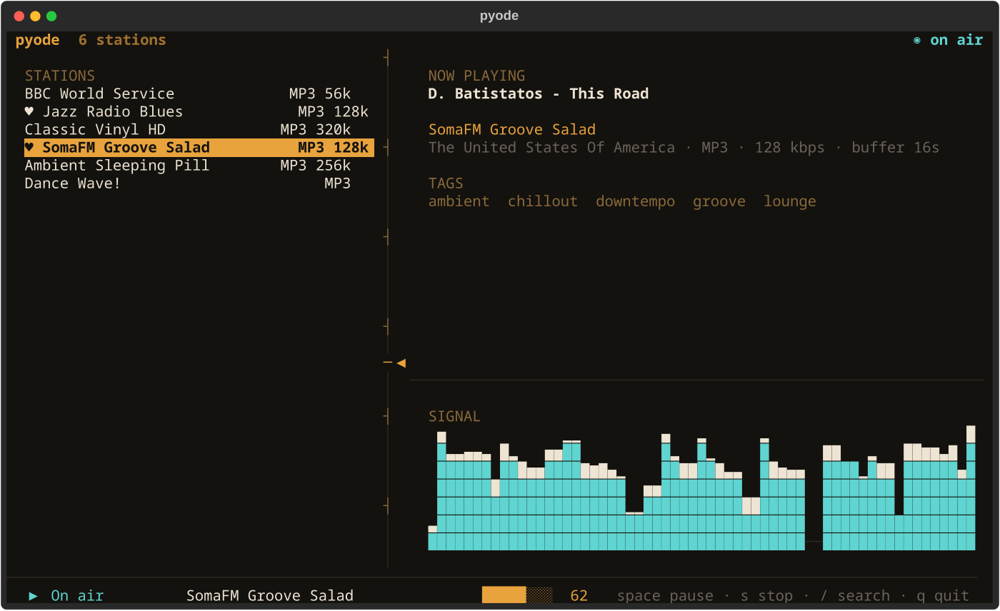

# pyode

A simple terminal internet radio player: a Textual TUI over libmpv, with a
station library kept in a plain CSV file and discovery via
[radio-browser.info](https://www.radio-browser.info/).



Stations on the left, what is on air on the right, and a signal meter that
reads the decoded stream — so it keeps moving even when you have it muted.

## Status

Complete and usable.

- [x] Phase 1 — player core (libmpv, ICY metadata, volume, error reporting)
- [x] Phase 2 — CSV station library (atomic writes, spreadsheet-safe)
- [x] Phase 3 — radio-browser.info API client
- [x] Phase 4 — Textual UI
- [x] Phase 5 — CLI polish

## Requirements

Python 3.12+ and **libmpv**:

| Platform | Install |
| --- | --- |
| Arch / CachyOS | `sudo pacman -S mpv` |
| Debian / Ubuntu | `sudo apt install libmpv2` |
| Fedora | `sudo dnf install mpv-libs` |
| macOS | `brew install mpv` |

## Station library

Stations live in a CSV file at `~/.config/pyode/stations.csv` (override with
`PYODE_STATIONS_FILE`). It is meant to be edited by hand or in a spreadsheet;
unknown columns are ignored, missing ones take defaults, and a malformed row is
skipped rather than taking the rest of the file down with it.

Favourites are a `favorite` column rather than a second file, so a station has
exactly one record and marking one cannot desynchronise from renaming or
deleting it. Reading accepts `true`/`yes`/`1`/`x`; writing is always
`true`/`false`.

## Command line

```bash
pyode                          # open the interface
pyode --station groove         # open playing the first match in your library
pyode --list                   # print the library and exit
pyode --no-visualiser          # start with the signal meter hidden
pyode --volume 60
pyode --stations ./other.csv   # use a different library file
pyode --play <url> --seconds 10 --silent   # headless, for testing a stream
```

`--list` writes the station names to stdout and a one-line summary to stderr,
so it pipes cleanly.

On the very first run — when the library file does not yet exist — pyode seeds
six varied stations so there is something to play immediately. Every seeded URL
was checked against a live decoder. Seeding keys on the file never having
existed, not on the library being empty: if you delete every station, it stays
deleted.

## Using it

Stations sit on the left, what is on air sits on the right, and the signal
meter is bottom right. The rule between the two panes is a tuning scale: the
needle marks where the playing station falls in your library.

| Key | Does |
| --- | --- |
| `p` / `Enter` | Play the selected station |
| `space` | Pause and resume |
| `s` | Stop |
| `f` | Favourite the selected station |
| `d` | Remove it from the library |
| `+` / `-` | Volume |
| `m` | Mute |
| `v` | Show or hide the signal meter |
| `/` | Search the directory |
| `q` | Quit |

The meter plots signal level over time, not a frequency spectrum, because time
is what the player measures. It reads the decoded stream ahead of the volume
stage, so it keeps moving while muted — it tells you the stream is alive, not
that sound is coming out. A stalled stream flatlines.

Start with it hidden using `pyode --no-visualiser`.

## Station discovery

Stations come from [radio-browser.info](https://www.radio-browser.info/), a
free volunteer-run directory. pyode identifies itself by User-Agent, asks the
server to filter out broken streams, and reports plays back so the community's
popularity ranking stays useful. The mirror is found over DNS, falling back to
`de1.api.radio-browser.info`.

## Small terminals

Below 68 columns the metadata pane is dropped and the station list takes the
full width; below 20 rows the signal meter goes too. The list and the controls
are what the app cannot do without, so they are what survive.

## Development

```bash
uv sync
uv run pytest
uv run ruff check .
```

Until the TUI lands, the entry point is a headless harness for the player:

```bash
uv run pyode --volume 65 --name "Smooth Jazz" <stream-url>
uv run pyode --silent --seconds 10 <stream-url>   # decode without an audio device
```

## Licence

pyode is licensed under the GNU General Public License, version 2 or later.
See [LICENSE](LICENSE).

It plays audio through **libmpv** via `python-mpv`, which inherits libmpv's
licence — GPLv2-or-later on a stock build, LGPLv2.1-or-later if libmpv was
built that way. The remaining dependencies (Textual, httpx, platformdirs) are
MIT or BSD.
